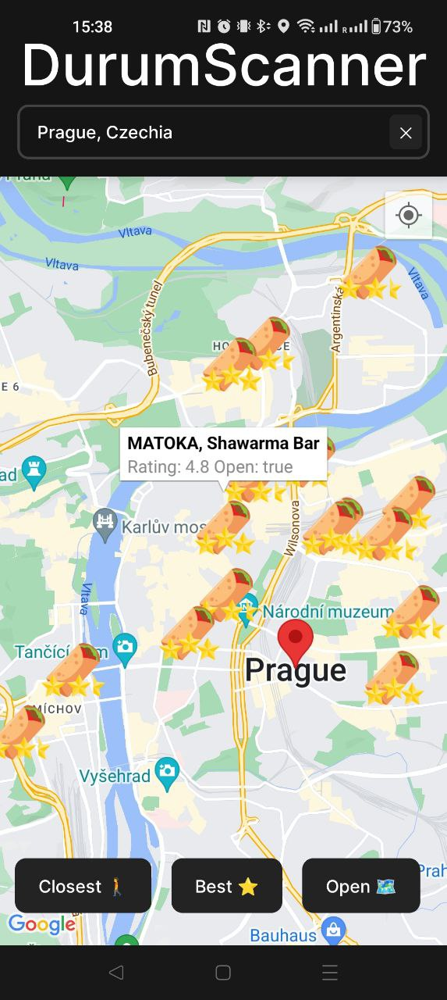

# DurumScanner

A simple app for scanning a selected location for nearby tasty durum goodness.
**iOS implementation is are not tested, web implementation is not finished**

## Features

- Searches in a 7 km radius from the given search location
- Provides quick access to open found places in google maps (can be tweaked to support different map integrations)
- Finds the best and closest durum place in search location

## Setup

1. Clone the repo
2. Make sure you have a React Native development environment [setup](https://reactnative.dev/docs/environment-setup?guide=native) for the platform you are targeting
3. run `npm i`
4. [Get a Google maps API key](https://developers.google.com/maps/documentation/android-sdk/get-api-key) and set in the .env file or create a .env.test file. For simplicity the development / test key can be unrestricted, but please be very cautious with the Google API keys as each developer accoount gets a limited number of free credits every month, after which google will charge your account based on your usage. You might also need to add the key to app.json file `googleMapsApiKey` field.
5. run `npm run android|ios|web`
6. When running in development the location and google maps services are mocked to reduce API calls / costs (see checks for `__DEV__` and modify if needed)

## TODO

- Add web support
- Fix and test iOS implementation
